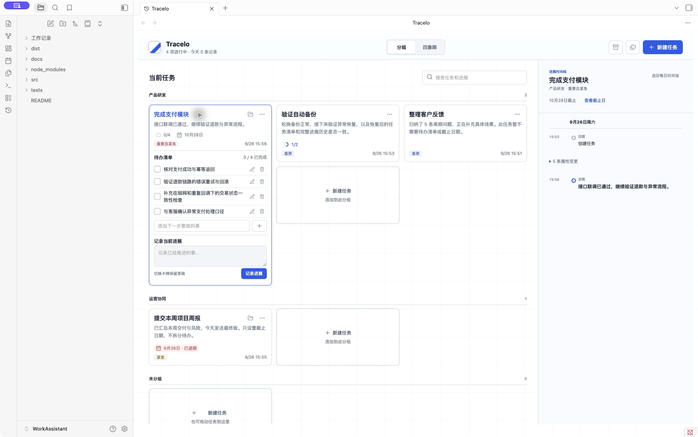
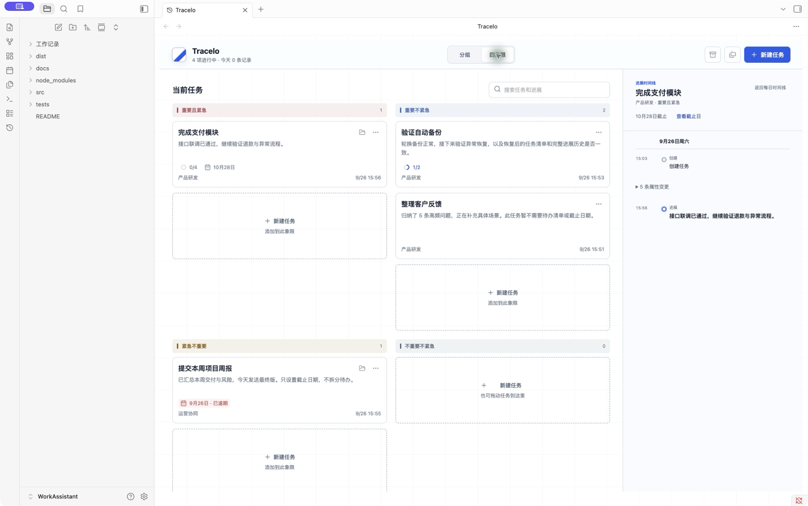

# 紧凑信息设计 · 0.5.0

本页记录 0.5.0 历史实现。0.6.0 已用[内容自适应卡片](content-adaptive-cards.md)替代整格高度、稠密补位及完整收起正文规则；其余信息语义保留。

0.7.0 进一步取消下文历史设计的属性变更折叠，改为连续主轴逐条显示；当前创建弹窗采用紧凑选择器与固定底栏。请以 [0.7.0 更新说明](../releases/0.7.0.md)及后续 [0.8.0 更新说明](../releases/0.8.0.md)为准。

2026-09-27。以 [compact-review 交互稿](compact-review/index.html) 为视觉依据，将信息去重、语义颜色和区域新建入口落实到真实插件。

## 信息层级

卡片从上到下为任务标题及操作、完整最近进展、可选待办／截止摘要、元信息；展开后追加清单及进展输入区。收起时元信息落在底部，展开时顺序自然排布。图标品牌保持左上角，主要新建按钮使用蓝色。

| 信息 | 显示规则 |
| --- | --- |
| 待办 | 比例环与 `2/4`，灰／蓝／绿对应未开始／部分／全部；完整提示保留“待办、已完成”含义 |
| 截止 | 未来中性短日期、今天琥珀色、逾期浅红底与明确文字；结束任务不标逾期 |
| 分组视图 | 区域标题说明分组，卡片只保留一个合并优先级标签 |
| 四象限 | 标题通过浅色底与短色条标明分类，卡片显示组名；优先级由所在区域说明 |
| 已结束 | 始终保留组名、优先级和结束状态，避免脱离原区域后丢失上下文 |
| 文件夹 | 已有目录显示打开图标；未创建时通过右键／三点菜单创建 |

颜色不单独承担信息：文本、分数、提示和区域名称始终存在。卡片保持中性背景，展开使用细蓝边框。深色模式使用独立语义色，文字对比度检查覆盖视图切换、主要操作、象限标题和摘要。

## 保留的布局与交互约束

- 基础行高 148px、间距 12px；根据独立内容容器测量，向上取最少整数行。允许 148、308、468、628px 等高度，不能固定四格，也不能改成任意高度。
- 最小卡宽 260px、自动列数、展开与同组卡片等宽、Grid 稠密补位保持不变。因此四象限内列数由真实可用宽度决定，不按示意稿强制两列。
- 长标题、进展和待办完整换行；窄屏扩大交互目标，并将时间线堆叠到任务下方。
- 空白／正文／元信息点击选中并展开，重复空白点击保持展开，标题切换收起。选择文字、拖动、表单和图标按钮仍隔离处理。
- 待办与截止日期均为可选；草稿持久化、待办编辑／删除撤销、结束任务只读、文件夹入口、自然语言命名、导入导出和备份机制保持原协议。
- 虚线新建卡占一格，不计入任务数；自动带入分组或象限，可在弹窗修改。取消返回焦点；成功清除搜索并展开新卡。

## 时间线

截止日安排独立于事件历史，日期导航与任务完整历史保持可用。相邻的属性变更合成一个原位置的 disclosure；可通过鼠标或键盘展开查看所有记录。在进展或生命周期事件处结束折叠组，不跨越日期或改变原顺序。展开状态在当前视图实例内保留，历史存储不删除、不改写。

原型中的示例数据、比较开关和说明面板只用于设计评审；正式插件继续使用真实存档、完整菜单、常驻新增待办输入框及手机时间线。

## 验证

运行 `PLAYWRIGHT_CHANNEL=chrome npm run check`：46 项单元／契约、27 组布局、71 项实际渲染交互检查、独立滚动、类型检查与构建通过。

新增回归覆盖比例环随勾选变化、待办不覆盖进展、今天／逾期／结束日期状态、日期清除、两种视图的信息去重、已结束上下文、历史折叠完整性、键盘展开与深浅色关键文本 4.5:1 对比度。原有整格临界高度、长内容、缩放、窄屏、空白点击、文件夹和迁移用例继续运行。

本目录 Obsidian 1.13.7 已安装构建并复核真实展开、收起与四象限。截图从原生窗口缩放至 1440px 宽用于文档展示；它们是实际插件，不是静态原型：

Windows Explorer 调用经过平台模拟、字面路径参数及错误处理检查；当前验证机器为 macOS，Windows 前台激活行为仍需实机确认。浏览器夹具模拟宿主样式和图标接口，不能替代所有第三方主题兼容性验证。
