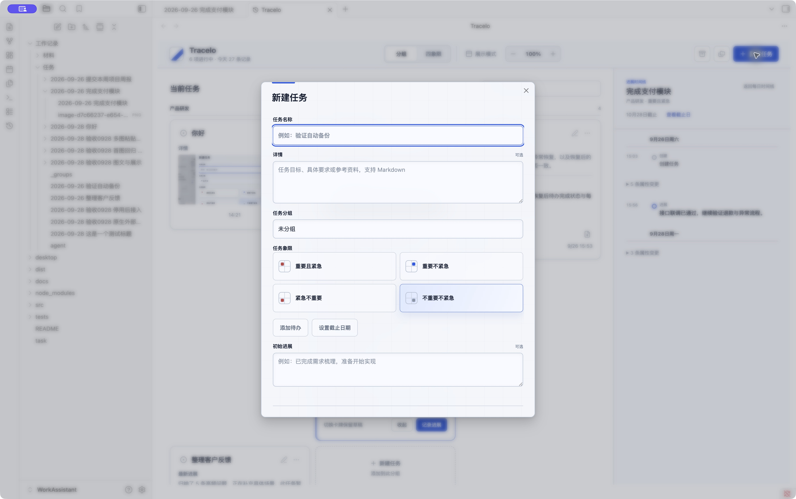

# 创建任务体验设计提案

日期：2026-09-28。状态：待评审，仅设计，未修改插件或原生工具实现。

后续状态：本轮用户要求完成新需求，0.7.0 已按此方案实施紧凑创建弹窗、会话草稿和快捷浮窗，并新增 Windows 原生工具。下文保留原始提案及当时证据，不作为当前实现状态；当前验收见[界面审视](../../validation/2026-09-28-ui-review.md)。

## 结论

采用「紧凑任务编辑器 + 轻量快捷浮窗」。沿用 Tracelo 蓝灰配色、系统中文字体和已有品牌图标。两个入口共享视觉语言，但插件承载完整属性，快捷工具优先快速记录。

首要目标：用户仅填写任务名称即可创建；创建按钮始终在可视范围内；扩展内容不能把按钮推走。所有尺寸是设计目标，尚未通过新版界面验证。

## 当前证据与限制

1. **打开插件新建任务：存在明显阻碍。** 当前真实 Obsidian 窗口截图中，任务名称、详情、分组、四象限及初始进展纵向堆叠，底部分隔线可见，但创建按钮不可见。标题自动获得焦点，属性标签和默认象限明确，这些优点应保留。
2. **继续填写可选内容：结构上会进一步增加高度。** 代码中添加待办、截止日期会在同一表单内追加内容；本次未填写或提交真实任务，未验证提交、错误恢复、缩放或屏幕阅读器行为。
3. **全局快捷入口：基于代码审查，未现场截图。** 当前工具未运行。`buildPanel()` 定义了 520 × 230pt 内容区、顶部说明、带凹边框的 480 × 128pt 编辑区，以及 11pt 快捷键提示；没有可点击的创建按钮。保留第一行标题、其余行详情以及 Esc 保留草稿的语义。

代码定位：`src/main.ts` 的 `NewTaskModal`、`styles.css` 的 `.wt-modal` / `.wt-modal-actions`，及 `desktop/Sources/TraceloCapture/main.swift` 的 `buildPanel()`。

高度问题有两层原因：可选文本域默认展开、四象限占两行大卡片；同时操作区处在滚动内容末尾，外层弹窗限制为最多 760px，但内层内容最大高度独立按视口计算。这种高度约束可能造成外层裁切，后续实现需一起处理。

## 方案 A：插件内紧凑创建弹窗（推荐）

桌面目标宽度 560px，默认高度约 420–460px，外侧保留至少 24px 安全距离。高度随内容变化，但不得超过可用窗口高度。不是固定高度的硬性截图要求。

| 从上到下 | 默认呈现 | 展开及交互 |
| --- | --- | --- |
| 窗口标题 | 左侧“新建任务”，右侧关闭 | 标题区固定；使用现有品牌小图标，不再添加装饰网格 |
| 任务名称 | 持续可见的标签 + 单行输入，打开自动聚焦 | 输入内容 16px；唯一必须填写的字段 |
| 详情（可选） | 约 64px 高的两行输入区 | 提示“补充目标、要求或参考资料”；支持现有 Markdown 输入，长内容在受限区域滚动 |
| 属性行 | 分组、任务象限两个并列的紧凑选择器 | 保留完整文字；宽度不足时改为上下两行 |
| 补充内容 | “添加待办”“截止日期”“初始进展”三个轻量入口 | 只展开被点击的内容；展开后聚焦相应输入，已有内容折叠后显示摘要 |
| 底部操作栏 | 左侧“⌘ Enter 创建”，右侧“取消”“创建任务” | 始终可见，独立于内容滚动；主按钮使用品牌蓝 |

### 具体设计决定

- **保留简短详情输入。** 详情常用于补充任务背景，默认两行保留直接输入能力，避免所有内容都藏起来。初始进展则默认折叠，减少两个大文本框造成的决策负担。
- **象限从四张大卡片变成一个选择器。** 默认展示完整的“不重要不紧急”，从分组／象限入口创建时继承入口上下文。展开后提供原有四项，当前项有勾选；色彩仅辅助识别，不用“普通”等模糊文案替换原语义。
- **不采用双列大表单。** 当前内容规模不需要扩大窗口来容纳所有空字段；紧凑属性行已经能减少纵向占用。
- **固定操作区靠结构保障。** 窗口由标题、可滚动内容、底部操作栏三段组成。超高内容只滚动中段，底部留有独立空间，不叠盖最后一行输入。
- **待办与进展始终可找到。** 展开后入口分别显示“待办 · 3”“初始进展 · 已填写”；再次收起保留输入。清除截止日期恢复“截止日期”入口。折叠与清空是不同动作。
- **详情不自动转成进展。** 任务说明与已发生的工作记录继续使用不同语义。

### 状态与键盘

- 标题为空时创建按钮禁用，并保留清楚的任务名称标签；输入有效标题后启用。
- 建议增加 ⌘Enter / Ctrl+Enter 提交；文本域内普通 Enter 换行。输入法选词期间不能触发创建。
- 写入中按钮显示“创建中…”且不可重复提交；失败保留全部输入，在操作栏上方显示简短错误和重试入口。
- 打开后焦点进入任务名称；Tab 按视觉顺序移动，展开内容后焦点可见，关闭后返回原入口。
- 插件弹窗当前关闭会丢弃表单内容。本提案建议增加会话内草稿：Esc、关闭按钮和取消均保留，下次打开恢复并提示“已恢复草稿”；显式“清空草稿”才丢弃。此项属于新增交互，需与视觉方案分开确认，实现时不能宣称已存在。
- 关闭成功与创建成功分开处理：只有确认写入成功，才清空草稿并关闭。

## 方案 B：快捷键唤出的轻量浮窗（推荐与 A 配套）

原生内容区目标宽 560pt，默认约 220–260pt；随着多行内容适度增长，上限 420pt，并受当前屏幕可见高度约束。浮窗沿用鼠标所在屏幕居中定位。

| 区域 | 设计 |
| --- | --- |
| 顶栏 | 现有 Tracelo 小图标 + “快速创建”；右侧安静的关闭入口 |
| 主编辑区 | 持续可见的标签“任务内容”；空态提示“要记下什么任务？”；第一行 20pt 中等字重，其余内容 14–15pt 常规字重 |
| 编辑提示 | 仅一行“第一行是标题，其余内容保存为详情”；有内容后适当弱化，但快捷键提示保持可发现 |
| 保存位置 | 简短显示实际 vault 名称与“未分组”，作为只读信息；完整任务目录可在提示或设置中查看 |
| 操作栏 | 左侧“⇧↵ 换行 · Esc 保留草稿”；右侧蓝色“创建任务 ↵”按钮 |

### 视觉处理

- 去掉编辑区的传统凹陷边框，采用连续、干净的面板表面，依靠留白与一条细分隔线区分输入区和操作栏。
- 面板圆角约 14pt，内边距 20pt，使用轻柔阴影。保留清晰轮廓，不叠加网格、厚重渐变或过强透明效果。
- 输入区占视觉主导，品牌与帮助文字退为次级。使用 macOS 系统字体，快捷键绘为低对比度键帽，帮助文字至少 12pt。
- 浅色采用接近白的冷灰背景；深色采用深蓝灰背景与更亮的蓝色焦点。输入文字所在表面保持足够不透明，避免桌面壁纸降低可读性。
- 控件获得焦点时有可见轮廓，关闭及设置图标有可访问名称；不以悬停作为唯一发现方式。

### 输入行为

- 保留当前 Enter 创建、Shift+Enter 换行、Esc 保留草稿的快捷习惯；新增按钮为同一提交动作提供鼠标入口。
- 保持一个逻辑上的多行编辑器。首行与正文的不同字号仅作为显示层格式，不修改原始文本、不引入富文本文件。
- 粘贴多行内容仍按现有第一行／后续行规则拆分，不根据自动折行拆标题，不改变原始 Markdown。
- 中文选词期间的 Enter 交给输入法，不能提交；选择候选后再次 Enter 才创建。
- 恢复草稿时显示短提示；写入失败在固定操作区上方展示错误，并保留输入。不要用错误信息替换全部快捷键说明。
- 没有配置保存目录时，把保存位置显示为“设置保存位置”，禁用提交，并提供明确的设置入口。
- 第一版维持现有默认象限和未分组行为。分组编辑、截止日期、待办不搬进快捷浮窗，避免把快速记录变成完整表单。

## 共用视觉规格

| 项目 | 建议值／原则 |
| --- | --- |
| 品牌蓝 | 沿用 `#245be7`，用于主动作和焦点 |
| 浅色文字 | 正文 `#172033`；辅助文字需通过实际背景对比度复核 |
| 间距 | 8 / 12 / 16 / 20，按信息组分配，避免所有字段都用大间隔 |
| 插件字号 | 窗口标题 18px；输入 15–16px；标签／帮助 12–13px |
| 桌面控件 | 属性控件约 36px；主要按钮约 40px；触屏目标至少 44px |
| 边框与阴影 | 中性细边框、单层柔和阴影；主按钮减少发光感 |
| 动效 | 120–160ms 淡入／状态反馈；尊重减少动态效果设置 |

## 后续实现的验收条件

这些是待验证标准，不是已通过的测试结果。

- 在 1280 × 720、1440 × 900 的桌面窗口中，空表单不滚动即可看到创建按钮；短窗口也不能把按钮裁掉。
- 窄至 360px、浏览器放大至 200% 时属性行重排，无横向溢出；焦点与错误提示不会被固定栏遮挡。
- 填写长详情、10 条待办及初始进展后，仅中间内容滚动，仍能直接操作创建按钮。
- 浅色／深色的正文和辅助文字满足可读性要求；重点复核禁用态、占位文本与焦点边界，不只凭截图判断无障碍合规。
- 分组／象限上下文继承不变，详情不会被写成进展。
- 快捷浮窗验证中文输入法、多行粘贴、恢复草稿、未配置目录、写入失败、多显示器和退出后焦点恢复。

## 本轮交付范围

只新增本设计文档和当前界面截图；未改 TypeScript、CSS、Swift，未创建或修改任何正式任务。当前没有可调用的内置图像生成工具，因此本轮交付为结构及交互规格，不声称提供了高保真效果图或已运行的新界面。
