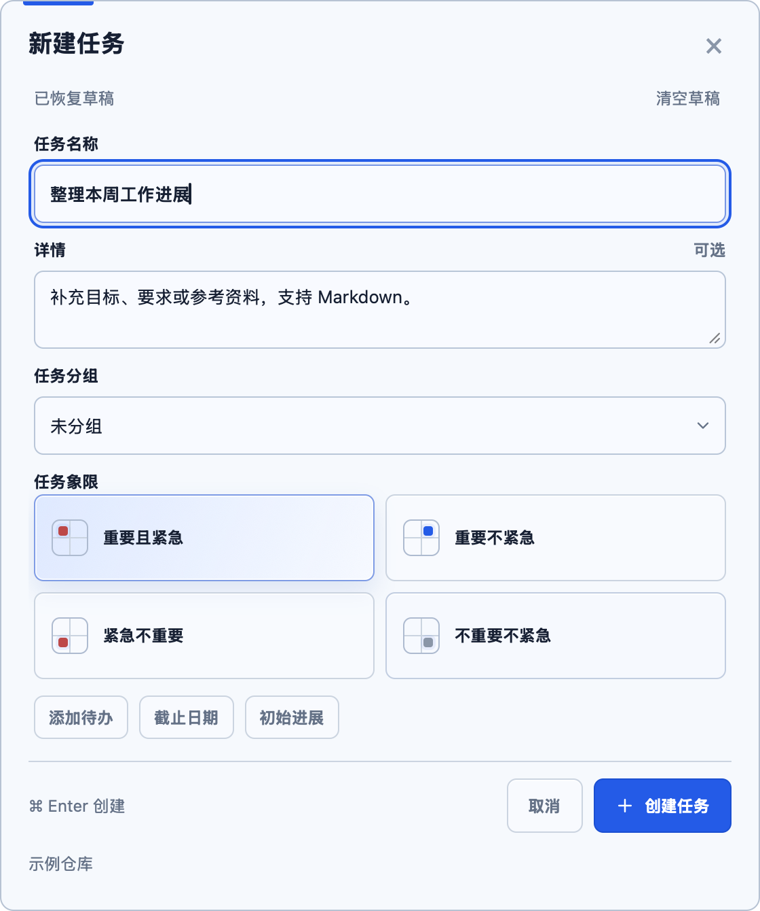
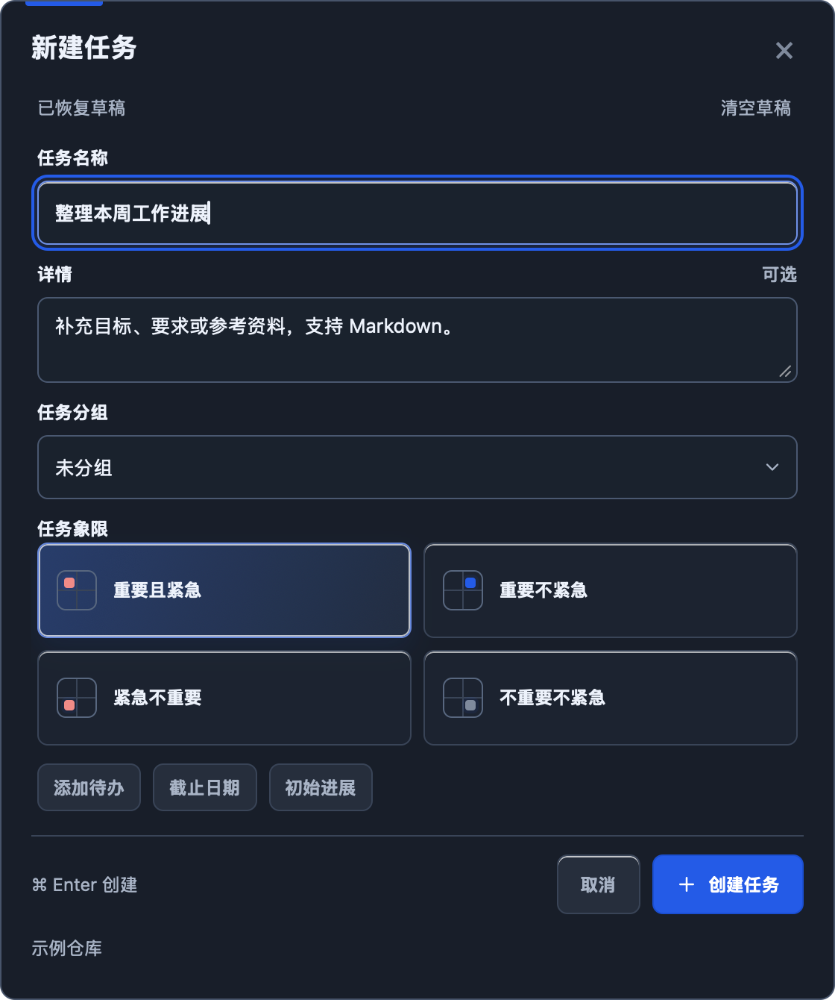
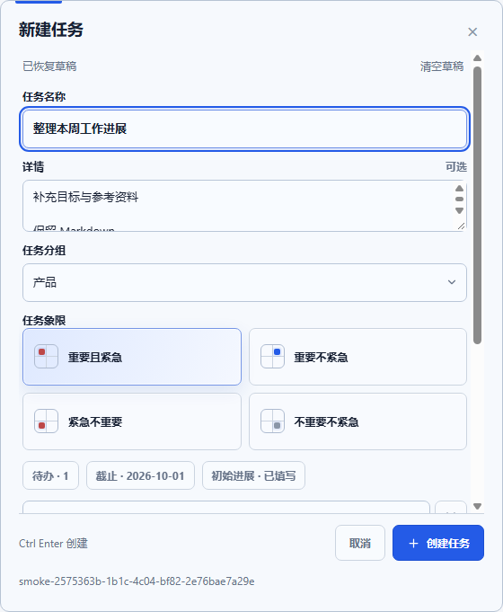
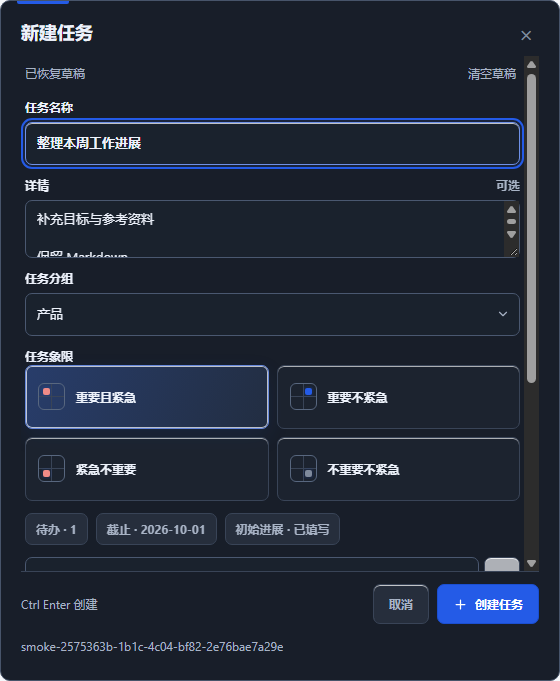

# 插件与桌面端共用完整创建表单

本轮将 Obsidian、macOS 与 Windows 的新建任务入口统一到同一份表单、样式和任务构建逻辑，纳入 0.8.0。本文记录开发阶段验证，最终发布与跨平台 CI 证据见 [0.8.0 发布验收](2026-09-28-release-080.md)。

## 实现

- `src/new-task-form.ts` 提供共用表单：独立标题与详情、任务分组、重要／紧急四象限，以及可展开的待办、截止日期、初始进展。三端共用字段校验、草稿、清空、取消、组合输入保护及 Cmd/Ctrl+Enter 创建行为。
- 象限选择恢复原有的 2×2 四块选项，保留象限小图标和选中高亮，四个选项直接可见；使用原生单选语义，支持 Tab 聚焦与方向键切换。插件、macOS 与 Windows 复用同一实现。
- 插件 `NewTaskModal` 与桌面 `capture.js` 仅适配各自宿主。桌面读取实际任务目录的 `_groups.md`；分组失效会提示重新选择，提交前再次检查分组变化，不会静默转为未分组。
- macOS 使用 WKWebView，Windows 使用 WebView2，内嵌相同 HTML、JS 与插件 `styles.css`。Windows 需要 WebView2 Evergreen Runtime；缺少时提供明确的安装入口。窗口底部额外显示保存位置及设置入口。
- 任务通过共用 `buildNewTask` 和 Markdown 序列化构建，再交给原生宿主校验与原子发布。失败重试沿用同一请求 ID，避免重复文件；切换保存目录会重新生成请求。
- 旧桌面文本草稿迁移为结构化草稿。取消、关闭与失败保留已填字段；仅修改分组／象限也会保留。插件任务文件已写入而排序偏好保存失败时，明确提示任务已创建，不诱导重复提交。
- 卡片底部使用固定两列：属性与辅助入口在左，时间始终靠右；属性换行不再挤动时间。

## 验证

- `DOTNET_PATH=/tmp/tracelo-dotnet/dotnet PLAYWRIGHT_CHANNEL=chrome npm run check` 全部通过：12 个文件、83 项单元／协议测试，无跳过；类型检查、生产构建以及布局、卡片、时间线、创建和入口错误路径浏览器回归通过。
- 桌面浏览器回归分别模拟 macOS／Windows 桥接，覆盖全部字段、四象限、实际分组解析、组合输入、重复点击、失败重试、分组变化、草稿清空、配置错误及浅深色／窄窗口。
- Swift 核心 8 项检查、Windows 核心 16 项检查通过；跨语言测试确认完整表单生成的存档能被原生宿主发布并由严格协议解析。
- macOS Universal 打包通过，包含 arm64 与 x86_64。实际打包应用的 WebKit 检查使用临时目录提交完整任务，核对精确存档字节及重复请求的幂等性。下方截图由生产 WebKit 表单生成，已人工核对。
- Windows 自包含发布构建通过；发布预检补齐 Windows runner 上的真实 WebView2 窗口、完整任务写入、原生热键消息和快捷键冲突检查，修复记录及 CI 链接见 [发布验收](2026-09-28-release-080.md)。
- 已将最新插件载入本机 Obsidian，并实际核对卡片时间对齐和完整新建表单；本机快捷程序也已加载新版。人工检查未创建或改动用户任务。
- 完整用户入口矩阵、发现及修复见 [用户入口走查](2026-09-28-user-entry-review.md)。

自动组合事件不替代真实中文输入法候选窗口验收。多屏、全屏、200% 系统缩放、读屏，以及 Windows 桌面人工交互仍需对应环境验证。

Windows runner 上发布模式构建的真实 WebView2 表单截图（可选字段展开，因此正文区滚动，底部操作保持可见）：

