# 2026-09-28 插件界面统一审视

本轮按现有蓝灰配色、系统字体和共享控件完成插件创建体验实现。使用 Product Design audit 的截图先行流程和 UI/UX Pro Max 的焦点可见性指导。所有下列截图来自本次 Codex 内置浏览器运行，并在保存后重新打开检查；不是历史效果图。运行入口：`node tests/helpers/ui-review-server.mjs`，使用真实插件代码和隔离内存 vault，不写入用户任务。

## 流程与结论

1. **看板与卡片：主体一致。** 卡片、分组、任务象限、截止提示和时间线采用既有蓝灰颜色、细边框和一致的主次信息关系。长进展和待办仍有独立展开入口。浅色与深色均检查；本轮不改卡片布局或时间线行为。

   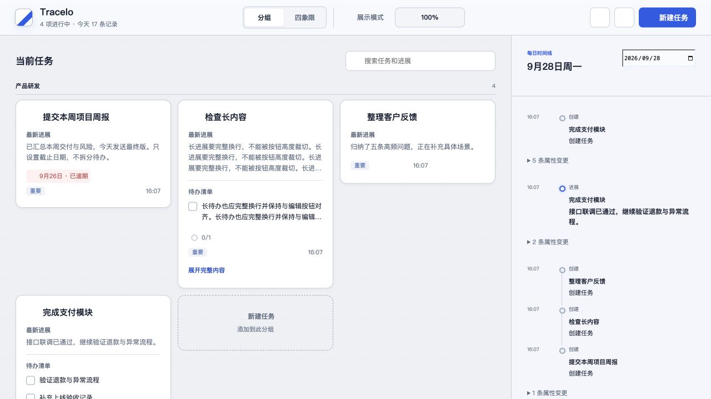
   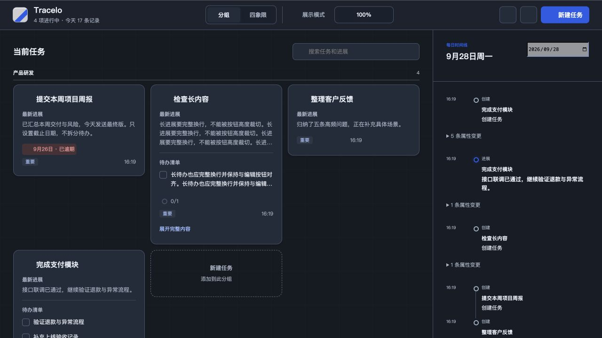

2. **创建任务：已修复阻断问题。** 改前在 1280×720 中无法看到创建按钮；改后采用约 560px 宽的紧凑弹窗，固定标题与底栏、中段独立滚动。分组／象限使用完整名称的原生选择器；待办／截止／初始进展按需展开，收起保留值并显示摘要。标题为唯一必填项，空标题禁用提交。

   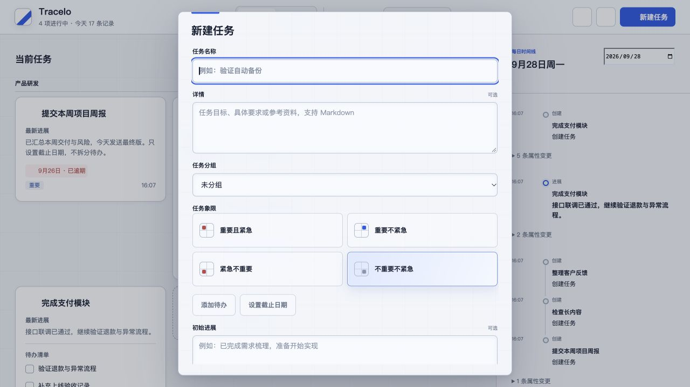
   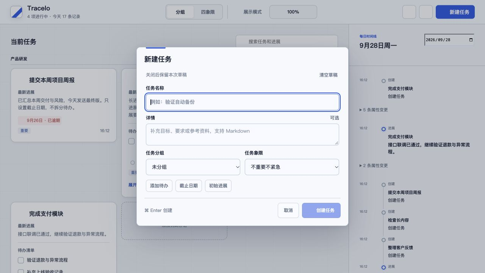
   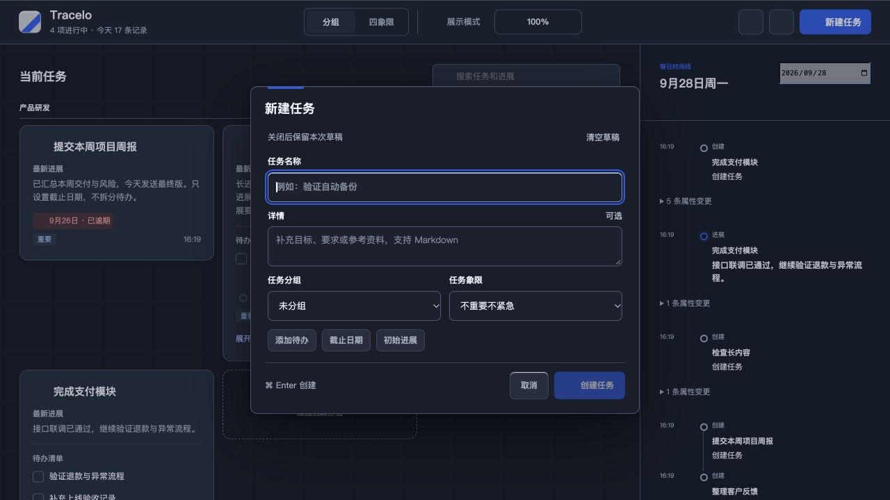

   会话草稿按 vault App 隔离：取消／关闭后恢复，清空草稿或成功创建后移除；不写入插件持久数据，重载插件后不保留。创建中的按钮和内容被锁定，防止重复提交；失败显示独立错误并保留全部字段。支持 Cmd/Ctrl+Enter，组合输入期间不会创建；普通文本域 Enter 保留换行。顶部和分组创建入口取消后恢复焦点。

3. **分组管理及文本提示：结构清楚，统一外壳。** 标签、取消／确认与输入焦点均明确。截图发现旧弹窗保留装饰网格和较强主按钮阴影；本轮将所有 `.wt-modal` 统一为浅／深蓝灰实色表面、18px 标题和无发光主按钮。下面两张为修正前证据。

   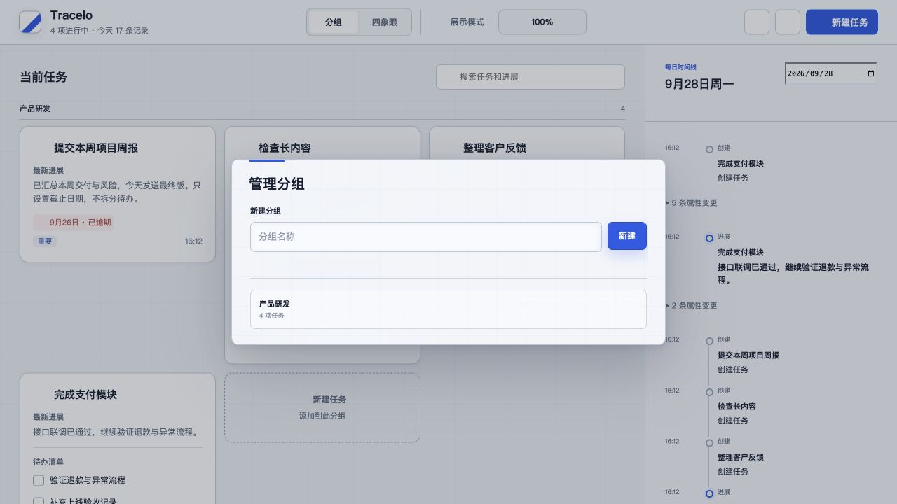
   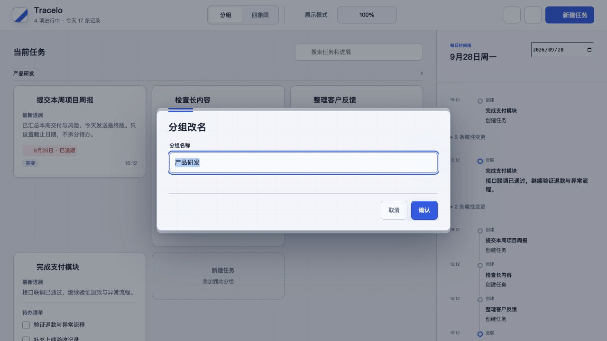

4. **导入导出：分区及风险说明可见。** 数据范围、100MB 限制、导入前预览及跳过已有任务说明均可见，确认导入在没有文件时禁用。与其他弹窗共用新外壳；本截图为修正前。本次视觉巡查未导入或导出真实数据。

   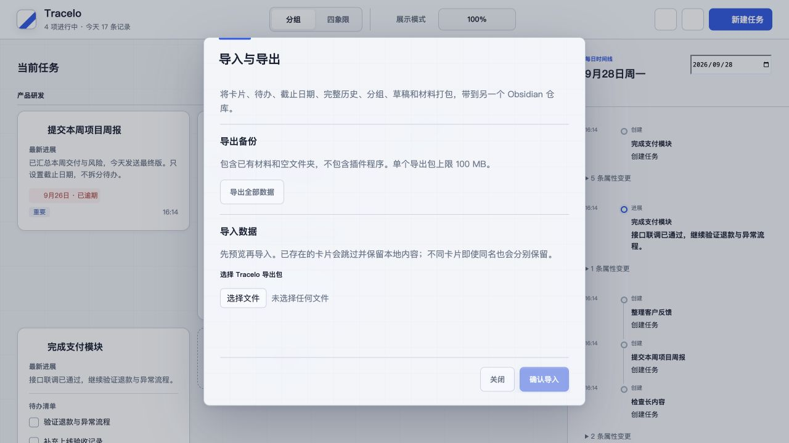

5. **图标选择：修复取消按钮风格偏差。** 搜索有持续标签，选中／继承／隐藏通过状态表达。旧取消按钮使用宿主默认样式，本轮纳入共用次级按钮。下面对比验证标题、背景、底栏一致性。浏览器宿主替身仅提供图标 SVG 容器，因此截图中的图形为空；不能据此判断真实 Obsidian 的图标形状或完整图标库质量。

   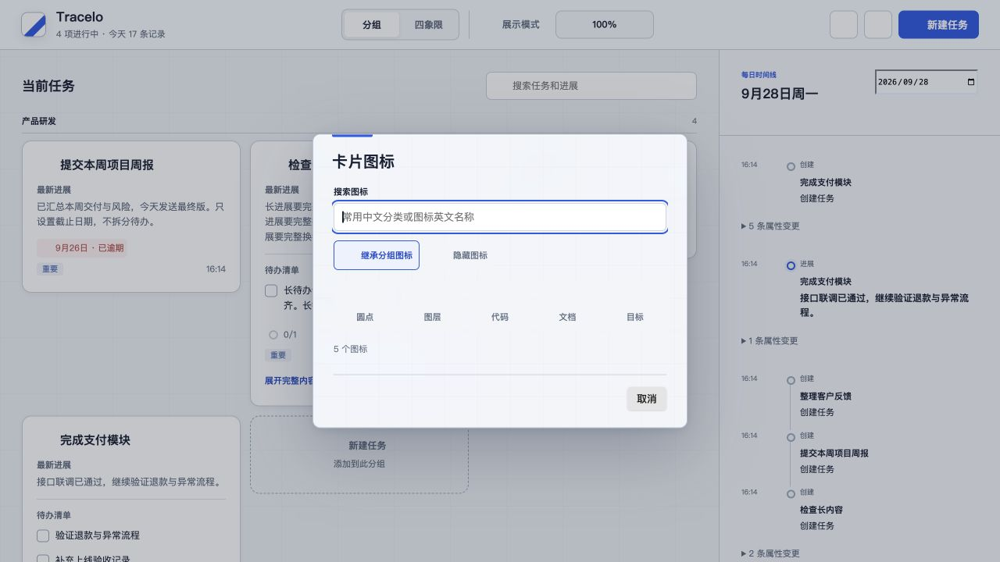
   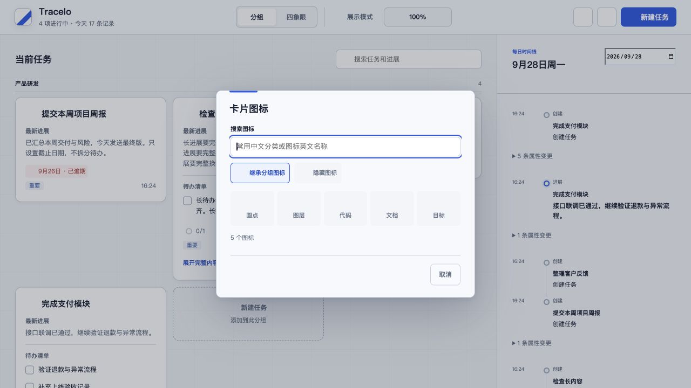

6. **日期弹窗：主要操作清晰。** 共享背景、标题和保存按钮已应用；本次截图后还把“今天／明天”纳入次级按钮。深色弹窗明确设置 `color-scheme: dark`，使原生日期等控件随主题呈现。

   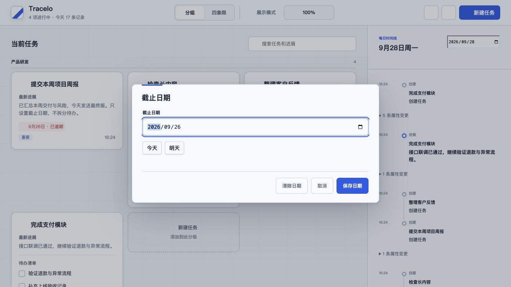

7. **详情与图片：代码和回归检查。** 图片查看器原先没有使用插件弹窗外壳，本轮补用 `.wt-modal`。现有真实渲染浏览器回归覆盖长图完整显示、点击图片不展开卡片、详情写入失败保留输入。图片查看器未另行截图，因此不声称完成该弹窗的现场视觉验收。

8. **设置及完成确认：代码审视。** 设置使用 Obsidian `Setting` 原生控件，保留宿主设置语言；完成确认使用共用弹窗／主次按钮，说明剩余待办。当前隔离浏览器没有完整 Obsidian 设置外壳和真实图标库，这两个界面没有以模拟截图冒充原生审视。原生快捷程序由独立工作分支负责。

## 验证与边界

- 新增 `tests/create-task.browser.mjs`：默认表单不滚动、展开 10 条待办后底栏可见、1280×720／1440×900／800×400／360×640／640×360 无横向溢出；取消后全部字段与折叠状态恢复、显式清空、焦点恢复；输入法事件、Cmd/Ctrl 快捷键、写入失败完整保留、重试仅创建一份。
- `npm test`、`npm run build`、`PLAYWRIGHT_CHANNEL=chrome npm run test:layout` 及新增创建测试均通过。已有创建入口测试改用选择器定位，保留四象限／分组上下文验收。
- 创建窗口标签及帮助文字至少 12px；主要按钮沿用品牌蓝。浅色占位文字改用可读的辅助文字色，深色错误文字改为较亮的红色。窄屏主操作与可选入口至少 44px。
- 640×360 是等效小可用视口检查，不能等同于所有宿主在实际 200% 缩放下的验证。合成 composition 测试不能代替真实中文输入法候选交互；Obsidian 宿主的 Esc／关闭图标、焦点陷阱、读屏顺序以及第三方主题仍需原生验证。截图与 DOM 测试不代表完整 WCAG 合规。
