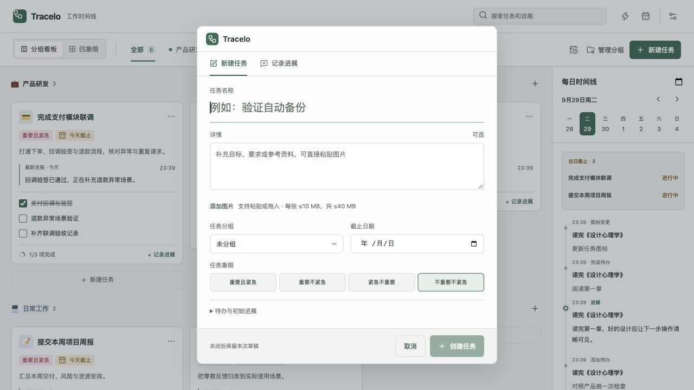
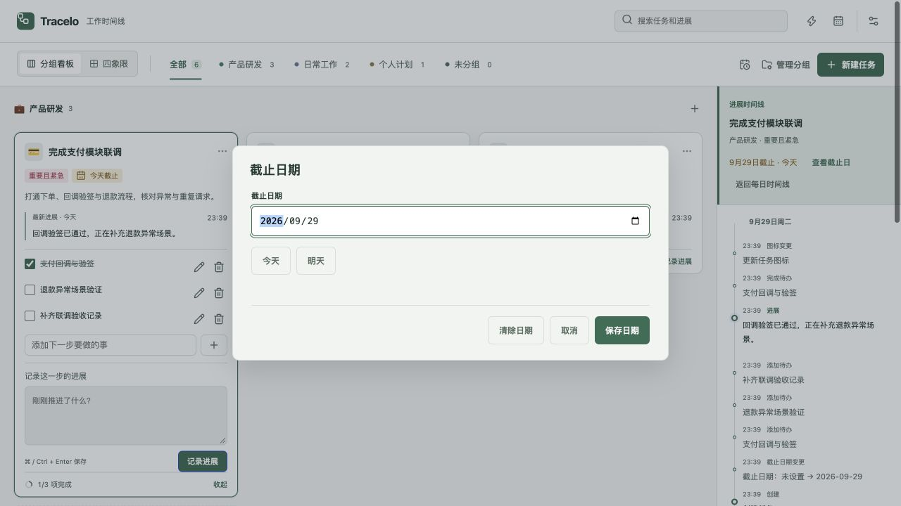
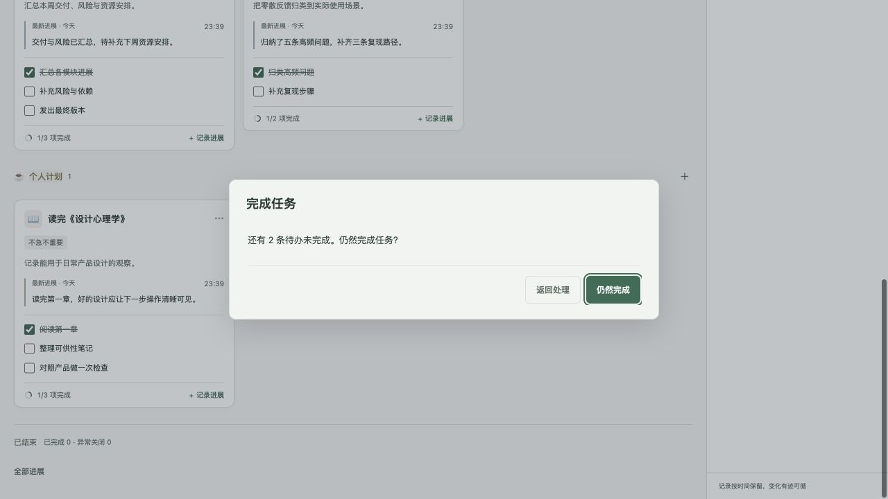
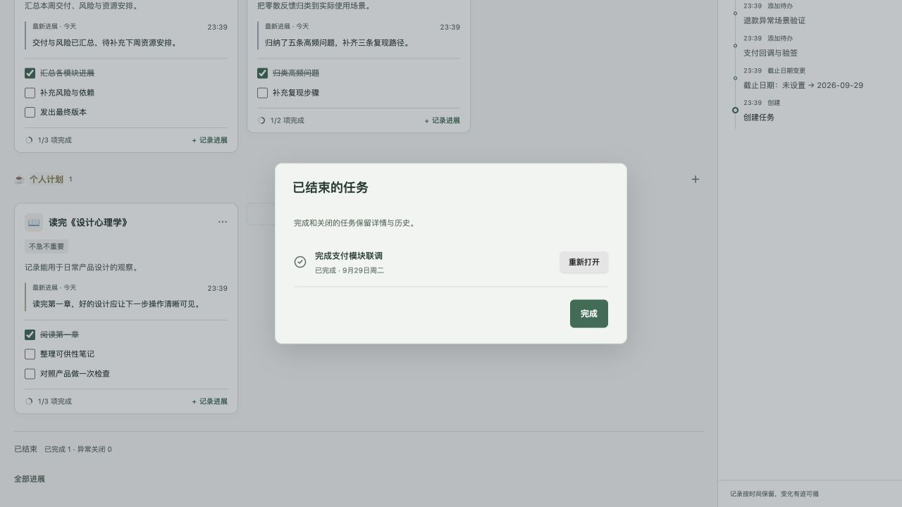
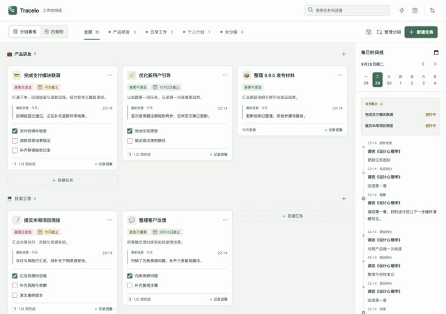
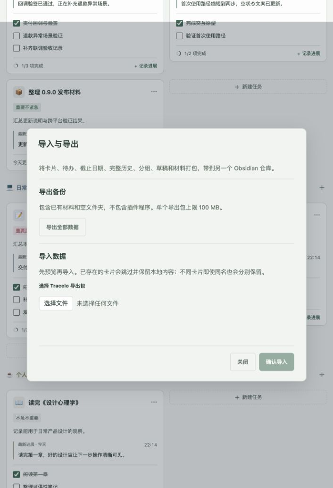
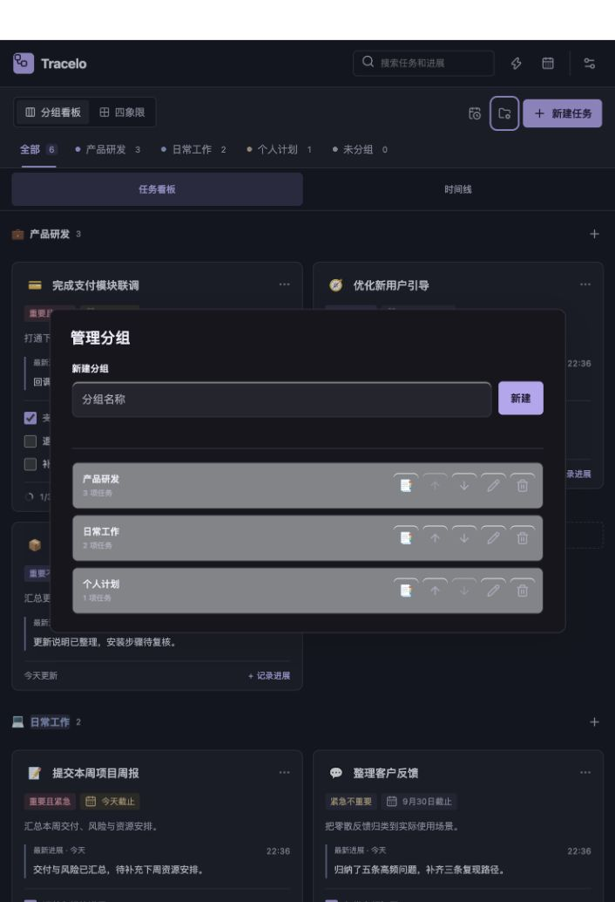
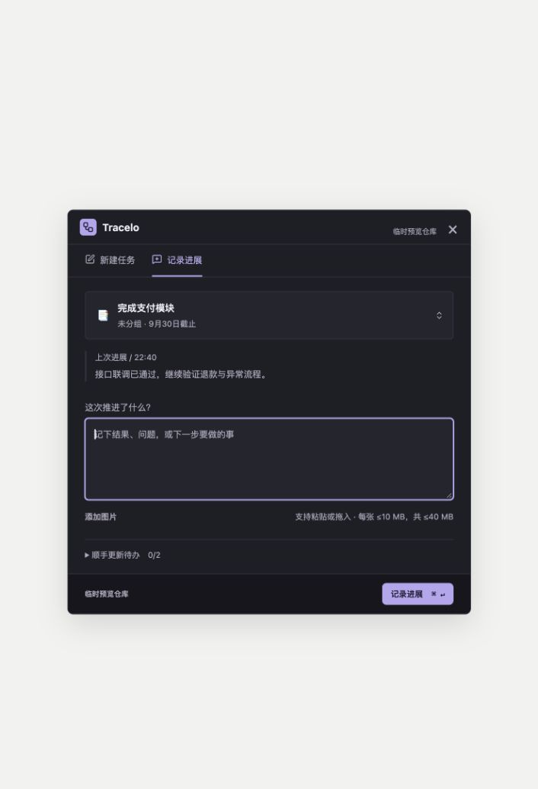

# 界面一致性审查 · 2026-09-29

## 结论

**续查后，已确认的主题与控件不一致已修正。** 看板、共享新建／进展表单、设置、图标选择器和辅助弹窗采用同一套语义配色与圆角。分组管理、图片预览、象限选中／悬停、归档重开操作不再受宿主明暗干扰。自动回归通过不等于所有真实宿主、外观组合与状态均完成视觉验收。

第一阶段审查基线为本地 `main` 的 `fec75aa`，当时只简化 README；以下原始截图保留作为修正前证据。用户随后授权修改，第二阶段在此基线上修改 `styles.css`，并新增 `tests/auxiliary-theme.browser.mjs` 接入 `npm run test:layout`。此前自动化及合并结果见[整合记录](2026-09-29-consistency-integration.md)。

## 续查与修正

1. **分组管理**：行背景、按钮悬停、危险操作、输入焦点改用主题变量，去除旧亮色内阴影。修复宿主深色规则覆盖 `--wt-faint` 等兼容变量的问题。
2. **新建任务**：修复深色宿主强制覆盖四象限选中颜色和悬停背景；独立浅色／深色与跟随宿主模式分别验证。
3. **图片预览**：原生 `dialog` 挂在 `body` 下，之前没有获得主题变量。现已纳入四主题作用域，背景、边框、关闭按钮及焦点均跟随插件外观。
4. **通用操作**：统一主／次操作与详情编辑的主题圆角；保留表单和紧凑控件合理的尺寸区别。日历导航与归档重开按钮不再使用宿主默认灰色样式。
5. **拖拽反馈**：高亮从固定蓝色改为当前主题强调色，保留原有 12px 留白和网格布局。

专项回归先复现失败，再修改样式并验证。覆盖四主题 × 三种插件外观 × 两种宿主外观的分组文字对比度（至少 4.5:1）；显式外观下宿主切换不改变结果；另外检查四主题深浅色的象限状态、图片预览、操作圆角，以及 390／720／1280px 分组弹窗和归档操作。

最终执行 `DOTNET_PATH=/tmp/tracelo-dotnet/dotnet PLAYWRIGHT_CHANNEL=chrome npm run check`，退出码 0：17 个测试文件、95 项单元／跨语言测试全部通过；类型检查、生产构建、77 项新增辅助主题检查及全部既有图标、布局、交互、日历、图片和快捷工具浏览器套件通过，无跳过。续查跨越 9 月 29 日夜间至 9 月 30 日凌晨；最终截图中的日期切换来自真实时钟。

上述一致性续查完成时尚未安装；随后已按用户要求完成本地重装，见下文 9 月 30 日补充。未推送或发布。

### 9 月 30 日：移除新建占位框并重新安装

- 移除分组看板和四象限的虚线“新建任务”占位卡，以及相关样式和瀑布流选择器；保留顶栏新建按钮、区块标题旁的加号和空分组拖入区域。
- 更新既有交互回归，先确认旧版因占位卡仍存在而失败，再验证修改后通过：87 项卡片交互、27 项布局／瀑布流、77 项辅助主题、顶栏导航及 13 项搜索导航检查；`npm run build` 通过。
- `bash desktop/package-macos.sh` 通过：arm64／x86_64 通用应用、签名验证和原生 WebKit 冒烟测试成功。
- 已替换本仓 `.obsidian/plugins/work-timeline/` 的三个程序文件并重载插件；已替换 `/Applications/Tracelo Capture.app` 并正常重启。插件文件与构建哈希一致，桌面应用全部 8 个文件逐项一致。
- 重装后真实 Obsidian 的分组看板、四象限均无新建占位框；顶部按钮和区块加号仍可见。已恢复分组视图，开发错误日志为空。截图：[分组看板](interface-fixes-2026-09-29/09-installed-board-no-placeholder.png)、[四象限](interface-fixes-2026-09-29/10-installed-quadrants-no-placeholder.png)。
- 备份位于本机 `/Users/skybcyang/Library/Application Support/TraceloCapture/Backups/reinstall-20260930-ETgqrC/`，含旧插件、旧应用、任务、草稿和快捷工具偏好。重装后 26 个任务目录文件和 2 个草稿文件逐字节不变；插件设置仅每日备份日期自动更新。
- 安装仍为版本字段 0.9.0 的未发布工作区构建；未提交本轮修改、未推送或发布。此次实机检查不替代下面的完整交互矩阵。

安装产物 SHA-256：

| 文件 | SHA-256 |
| --- | --- |
| 插件 `main.js` | `b936c89198b49927a1bb0bd6173eb8e89bc93e9ac0acf3c00974964487f5504f` |
| 插件 `styles.css` | `4773f9e1df1134246b8b024f47e8b4215016b64911a092949d22ffeae753ce21` |
| 插件 `manifest.json` | `2445ddffa948f0da18870f9739a19d7d7c05880fb4b9a9dba7aaa7512824359e` |

### 续查截图与结果

| 步骤 | 界面 | 结果 |
| --- | --- | --- |
| 1 | 改名提示 | 配色正确，通用圆角已收口 |
| 2 | 四象限看板 | 结构与语义状态色一致 |
| 3 | 深色分组管理 | 修正后文字与操作清晰 |
| 4 | 深色宿主中的浅色新建表单 | 象限选中态保持浅色主题 |
| 5 | 详情编辑与单任务历史 | 配色与操作层级一致，圆角统一 |
| 6 | 截止日期提示 | 输入与主次操作跟随主题 |
| 7 | 完成任务确认 | 提示、返回与确认层级清楚 |
| 8 | 已结束任务列表 | 发现并修正重开按钮的宿主默认样式 |

上述操作只修改隔离内存测试任务，没有改写真实仓库任务。图片预览和错误状态以生产组件自动回归验证，本轮未通过系统文件选择器上传图片。原始截图与续查截图分别保留，避免把修正前界面标为通过。

## 方法与证据边界

通过 Codex 内置浏览器加载当前主线的生产渲染代码，使用 `tests/helpers/ui-review-server.mjs` 的隔离内存仓库；桌面页加载共享表单与桌面资源。没有读写真实任务。所有下列截图均为本次新捕获并逐张检查。

前两张使用 1280 × 900 CSS 视口；后续使用内置浏览器默认视口。视口覆盖曾造成截图裁切，重置后重新捕获，不使用失真的截图作为证据。截图比例不同，不用于逐像素尺寸对比。

本次抽查矿物绿浅色与石墨紫深色，并非“四主题 × 深浅色 × 所有弹窗 × 所有状态”的完整矩阵。浏览器模拟宿主不等同于 Obsidian、macOS WebKit 或 Windows WebView2 实机；原生文件选择器、菜单和系统焦点不在本次验证范围。桌面截图外部浅色区域是预览页面背景，不视为应用主题缺陷。

## 逐步检查

| 步骤 | 界面／操作 | 状态 |
| --- | --- | --- |
| 1 | 浅色分组看板与每日时间线 | 基本一致：卡片、分组、状态色与时间线层级协调 |
| 2 | 界面与快捷工具设置 | 基本一致：分区、控件与主题一致 |
| 3 | 导入与导出 | 部分一致：配色统一，按钮尺寸／圆角仍有旧规则 |
| 4 | 新建任务 | 基本一致：表单分区、可选字段与底部操作层级清楚 |
| 5 | 截止日历 | 基本一致：日期与任务详情配色统一；未遍历所有日期状态 |
| 6 | 快捷记录进展 | 基本一致：当前任务、上次进展与输入区层级清楚 |
| 7 | 展开快捷任务选择器 | 基本一致：搜索、当前项和列表同主题；列表独立滚动 |
| 8 | 石墨紫深色看板 | 基本一致：背景、卡片、标签与控件跟随主题 |
| 9 | 深色管理分组 | **未通过**：旧浅色行背景降低文字对比度 |
| 10 | 深色分组图标选择器 | 基本一致：与主界面同主题，选中和焦点可识别 |
| 11 | 桌面共享快捷进展表单（浏览器预览） | 基本一致：结构与插件快捷入口一致；原生窗口未验收 |

### 1. 浅色看板与时间线

### 2. 设置

### 3. 导入与导出

### 4. 新建任务

### 5. 截止日历

### 6. 快捷进展

### 7. 任务选择器

### 8. 深色看板

### 9. 深色分组管理

### 10. 深色图标选择器

### 11. 桌面共享表单

## 第一阶段发现的问题（续查已修正）

### P2：分组管理没有完整跟随插件的独立外观设置

证据为步骤 9。宿主没有 `.theme-dark`，插件设置为 `graphite` + `dark` 时，弹窗背景已经是深色，但 `.wt-group-manager-row` 仍计算为 `rgba(250, 252, 255, 0.48)`。任务数量文字为 `rgb(175, 171, 189)`，分组名为 `rgb(240, 237, 248)`，导致浅色行上文字发灰。

根因位于 `styles.css` 的分组管理规则：背景使用硬编码浅色值，深色分支只匹配 `.theme-dark`；当前四主题则使用 `data-tracelo-theme` 和 `data-tracelo-appearance`。建议行背景改用语义主题变量，并验证宿主明暗与插件独立明暗交叉组合。截图只能说明可见问题，不能据此宣称完整无障碍合规。

### P3：辅助弹窗仍有独立控件尺寸与圆角规则

证据为步骤 2、3、4。矿物绿下导入导出的主操作为 6px 圆角，次操作仍为 4px；导入导出按钮高 40px，设置页使用更紧凑控件。尺寸差异可以服务不同场景，但目前来自叠加的旧 CSS，缺少明确的统一规格。建议先明确标准／紧凑按钮规格，再统一次操作圆角与通用弹窗间距；不应简单把所有控件强制成同一高度。

## 尚不能勾选的范围

- 图片预览及所有空状态／错误状态的完整人工逐屏矩阵；相关生产组件已有自动回归。
- 四主题、深浅色、跟随宿主与独立外观交叉组合的所有辅助弹窗。
- 超窄视口、长文本、缩放与键盘／屏幕阅读器的完整矩阵。
- 最新构建的 Obsidian 完整交互验收，以及 macOS／Windows 原生窗口、输入法、多屏、剪贴板与焦点恢复；本次已完成本地安装、Obsidian 两种看板检查及 macOS 构建冒烟。

已将辅助主题交叉检查加入持续回归。后续重点为其余真实宿主交互验证；当前自动化覆盖及有限实机检查不能替代上述未完成项。
