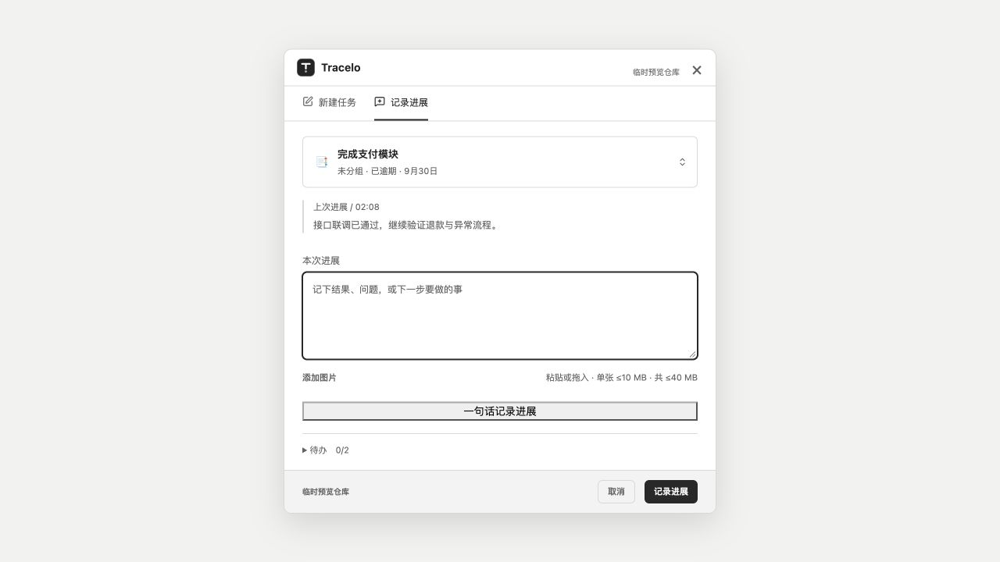
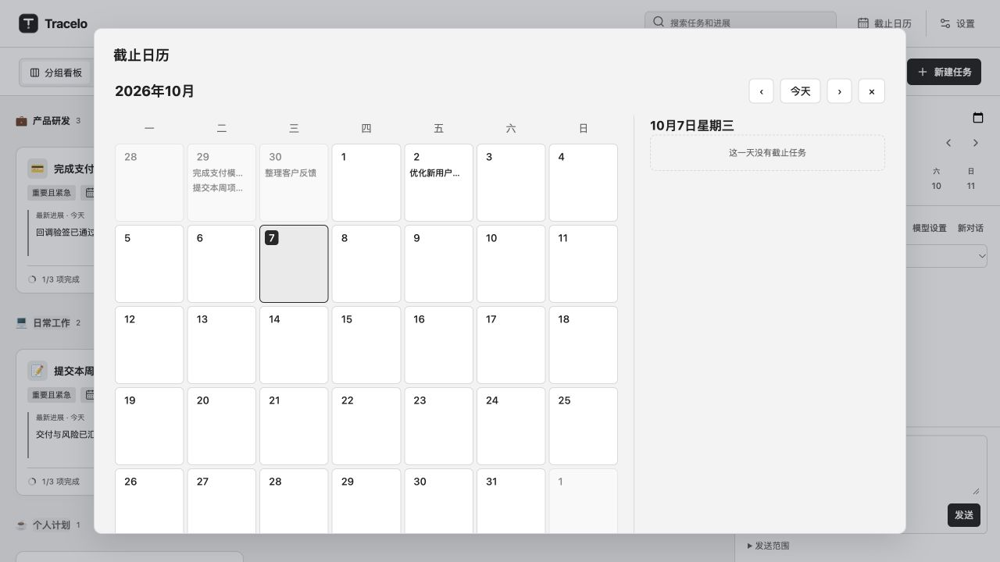

# 已批准 UI 修改与设计复审

2026-10-07。保持既有紧凑单色界面；仅实施用户从第二轮样例中批准的 32 项。实现位于现有 `2f4c` 工作树，未把样例或旧主目录整体覆盖到最新源码。

## 已落实的范围

| 编号 | 实际处理 |
| --- | --- |
| A04 | 待办两个操作合并为常显三点菜单；编辑、删除和撤销保留。共享卡片由宿主提供菜单，Obsidian 使用原有菜单，快捷程序使用本地对话菜单，不引入 Obsidian 运行时依赖。 |
| A05 | 三点按钮 30×30；编辑态收起/结束编辑点击区至少 28×28，沿原底栏中心扩展，不增加底栏高度；粗指针规则为至少 44×44。 |
| A07 | 按钮键盘焦点与记录进展边框使用主题强调色。 |
| A09 | 窄屏面板切换按钮字号 12px、高度至少 36px、间距 8px。 |
| A10 | 工作侧栏可整体滚动，消息区最低 120px，输入区不被压缩，截止列表最高 112px。 |
| A11 | 快捷记录增加取消，保留草稿；待处理、成功确认及组合输入期间保护关闭。 |
| B01 | 删除顶栏“工作时间线”。 |
| B03 | 仅展示模式编辑卡片将“结束编辑”换为 ×，保留可访问名称和悬停说明。模式切换同步更新。 |
| B04–B05 | 卡片输入区标签仅供辅助技术使用；卡片和快捷窗口移除常驻提交快捷键文字，保留快捷键、按钮提示和可访问属性。 |
| B06 | 删除无待办卡片重复的更新时间；没有进展时显示创建时间。 |
| B07–B08 | 详情帮助去掉“支持”；对话空态改为“暂无消息”。 |
| B09–B12 | 新建删除常驻草稿说明、隐藏空提示行；简化详情占位和图片说明；创建快捷键移至按钮提示。真实恢复状态及图片限制保留。 |
| B13–B16 | 快捷记录不显示“未设置截止日期”；空进展改“暂无进展”；标签改“本次进展”；折叠区改“待办”并保留计数。 |
| B17–B20 | 一句话创建删除重复介绍；记录保留任务名、去掉前缀；简化模型状态；删除听写说明，保留发送数据范围和确认前不修改任务。 |
| B21–B22 | 日历删除重复说明与空日期的 0 项计数，有任务时仍显示数量。 |
| B23–B24 | 设置删除重复“任务看板”标题；默认快捷键说明去掉“以上为”。 |
| B25–B26 | 搜索空态简化为“试试更短的关键词，或清除搜索。”；已结束任务删除重复介绍。 |
| B27 | 通用创建/图标变更事件不重复展示正文，事件标题和时间仍在，原始数据不删；搜索命中时保留原文和高亮。 |

明确未实施 A01、A02、A03、A06、A08、A12、B02：不放大卡片字体，不改两行摘要及待办行布局，不移除卡片底线或增加提交区留白，不隐藏窄屏看板工具，不用图标替代保存位置文字，普通“收起”仍是文字。

## 验证结果

- `npm run build`：类型检查及插件构建通过；`node desktop/build-form.mjs`：桌面共享表单构建通过。
- `npx vitest run tests/quick-operations.test.ts tests/work-conversation.test.ts tests/smart-capture.test.ts`：3 文件、29 项通过。
- `bash desktop/package-macos.sh`：arm64/x86_64 构建、签名验证及原生共享表单/原子发布冒烟通过。
- 1280×720 同一夹具：收起卡片改动前后均 188.09375px；标题 13px、正文 11px 未变。支付任务展开由 539.4375px 降为 522.9375px；三点 30×30、收起 28×28。
- 实际页面检查：三点菜单展开和编辑入口；快捷程序隔离夹具编辑待办并读回新内容；普通/展示模式切换保留输入草稿，展示模式关闭图标有可访问名称；查看新建、一句话整理、日历、明暗主题。
- 680×560：切换按钮 12px/36px，侧栏可视高 359px、内容高 520px，可滚动到完整输入框及发送按钮；消息区 120px，无页面横向溢出。保留完整看板工具。
- 预览宿主原先缺少 Obsidian 的 `showAtPosition`，仅补齐该适配方法。模拟宿主不等于真实 Obsidian 验收。

未测边界：真实触屏的 44px 操作、真实中文候选窗、Windows GUI、全部主题/缩放/长内容矩阵；本轮未经 UI 执行删除动作，删除/撤销沿用既有路径并通过相关操作测试。取消在待回执状态及原生重开后的草稿恢复尚未完成专项实机验收。没有采集动效过程，不评价动效。

## 一轮独立设计审查

使用 oil-ui 的已有界面评审协议，一个全新上下文的只读审查者逐张查看 10 张当前截图，不读源码、不打分。图证为 1280×720，窄屏两张为 680×560。结论：现有紧凑布局、双层顶栏、图标分工、卡片尺度及明暗主题保持一致，没有必须放大卡片的问题。

以下两项仅为下一轮建议，本轮未改：

1. **快捷记录的一句话按钮不统一。** “一句话记录进展”呈横贯表单的方角、双层深描边，明显强于周围次按钮。建议复用已有次按钮样式，保持位置和功能，不改卡片密度。
2. **日历末行视觉裁切。** 720px 高窗口下最后一周底边和底部留白被弹窗下沿截断。建议日历格适配可用高度，露出完整末行；只调整日历，不改任务卡片。截图不能证明是否可滚动，因此不把它描述为功能不可达。

审查没有新增明确可删除的字。原先记录按钮紧贴底线的处理属于未批准的 A06，继续保留当前结构。

## 安装与证据

插件三件套已安装到项目实际 vault 的 `.obsidian/plugins/work-timeline/`；保留原有 `data.json`。macOS 应用已更新到 `/Applications/Tracelo Capture.app`，完整 Contents 与打包产物一致，签名验证通过；已重启安装路径进程。

插件构建 SHA-256：`main.js` = `ab88e6d1b18a12afc46a1b8f7f222b9e9a1c660d1f22100b6d7a687ba62ebb91`；`styles.css` = `af48eb12ccc8d6311de5934d2cfbb430e65717e0ab7c2e55a0d9134a72f36f5e`。安装文件逐项相同，正式任务目录与安装前备份无差异。

实机收尾限制：中断后本会话的电脑操作工具不再可用；Obsidian CLI 只返回安装器过旧提示，未确认插件已重载。快捷程序进程已重启，但此次安装后的真实界面入口未再确认。不能把产物一致和模拟页面通过写成宿主实机全部通过。

安装前插件、应用、配置、草稿及正式任务备份在项目主目录 `.local/ui-approved-2026-10-07/install-backup/`；改动前源码在同目录的 `before/`。没有提交、推送或发布。

当前实现隔离预览：`node tests/helpers/ui-review-server.mjs`，访问 `http://127.0.0.1:4179/?collection`；快捷记录入口为 `/capture?mode=progress`。预览写入只在内存中，刷新重置，不连接真实模型。

其他图证：[紧凑看板](ui-approved-2026-10-07/board.jpg)、[展开卡片](ui-approved-2026-10-07/expanded.jpg)、[展示模式](ui-approved-2026-10-07/presentation.jpg)、[新建](ui-approved-2026-10-07/create.jpg)、[一句话整理](ui-approved-2026-10-07/smart-create.jpg)、[深色](ui-approved-2026-10-07/dark-board.jpg)、[短窗口滚动前](ui-approved-2026-10-07/narrow-chat.jpg)、[短窗口输入区](ui-approved-2026-10-07/narrow-chat-input.jpg)、[待办菜单](ui-approved-2026-10-07/todo-menu.jpg)。
